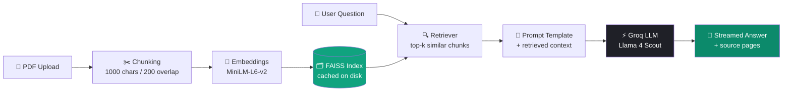

<div align="center">

# 🧠 DocMind

### Chat with any PDF — instantly, intelligently, beautifully.

**An open-source RAG (Retrieval-Augmented Generation) chatbot** that lets you upload a PDF and have a real, grounded conversation with it — powered by **Groq's Llama 4 Scout**, **FAISS vector search**, **LangChain**, and a premium **Streamlit** chat UI styled like ChatGPT.


**Keywords:** RAG chatbot · PDF question answering · chat with PDF · LangChain · FAISS vector search · Groq Llama 4 · Streamlit AI chat app · document AI assistant · local LLM PDF reader

</div>

<br>

## ⚡ Quick Start

```bash
git clone https://github.com/sarthakarsul18/docmind-rag.gi && cd docmind-rag
pip install -r requirements.txt
cp .env.example .env          # then add your GROQ_API_KEY
streamlit run app.py
```

Full walkthrough below 👇

---

## 📑 Table of Contents

- [Overview](#overview)
- [Features](#features)
- [Preview](#preview)
- [Architecture](#architecture)
- [Tech Stack](#tech-stack)
- [Project Structure](#project-structure)
- [At a Glance](#at-a-glance)
- [Getting Started](#getting-started)
- [Configuration](#configuration)
- [Customization](#customization)
- [How It Works](#how-it-works)
- [Usage Guide](#usage-guide)
- [Troubleshooting / FAQ](#troubleshooting--faq)
- [Roadmap](#roadmap)
- [Contributing](#contributing)
- [License](#license)
- [Acknowledgments](#acknowledgments)

---

## 🔍 Overview <a name="overview"></a>

**DocMind** turns any PDF into an interactive conversation. Upload a document, ask questions in plain English, and DocMind retrieves the most relevant passages before asking **Groq's Llama 4 Scout** to answer **strictly from your document's content** — with full source transparency, so you always know exactly which page an answer came from.

No more `Ctrl+F`. No more skimming 40 pages for one paragraph.

---

## ✨ Features <a name="features"></a>

| Feature | Description |
|---|---|
| 💬 **ChatGPT-style chat UI** | Dark theme, rounded bubbles, smooth fade-in animations |
| ⚡ **Real-time streaming** | Answers stream token-by-token with a live typing indicator |
| 🧠 **Grounded answers** | The model answers only from retrieved context — built to avoid hallucination |
| 📄 **Source transparency** | Every answer has an expandable "View sources" panel with the exact page & excerpt used |
| 🗂️ **Smart caching** | Each PDF is content-hashed — re-uploading the same file skips re-embedding entirely |
| ⚙️ **Live tunable settings** | Adjust retrieval depth (`k`) and response creativity (`temperature`) on the fly |
| ✨ **Suggested prompts** | One-click example questions when starting a new chat |
| 🔄 **Force re-index** | Rebuild the vector index anytime the source PDF changes |
| 🧹 **Clean session control** | Clear the conversation with one click, without losing your indexed document |
| 🌌 **Ambient gradient theme** | Soft glowing background accents, gradient title, and a "RAG-Powered" hero badge |
| 🟢 **Live status indicator** | A pulsing dot in the sidebar shows your document is indexed and ready |
| 🪄 **Shimmer buttons** | Primary actions have a subtle light-sweep hover effect for a polished feel |
| 🛡️ **Cross-version safe UI** | Sidebar controls stay visible and functional across different Streamlit releases |

---

## 🖼️ Preview <a name="preview"></a>

**What the experience feels like:**

| | |
|---|---|
| 🎨 **Theme** | Dark, ChatGPT-inspired, with ambient green glow accents |
| 💬 **Chat bubbles** | Rounded, color-coded — green for you, charcoal for DocMind |
| ⌨️ **Live typing** | Pulsing "thinking" dots, then the answer streams in word-by-word |
| 📄 **Sources panel** | Collapsible, sits under every answer, shows the exact page used |
| ✨ **Empty state** | Suggested example questions appear as one-click chips |
| 🏷️ **Hero badge** | A "RAG-Powered · Groq Llama 4 Scout" pill under the title |
---

## 🏗️ Architecture <a name="architecture"></a>



**In plain words:**

1. You upload a PDF → it's split into overlapping text chunks.
2. Each chunk is embedded into a vector and stored in a FAISS index (cached by file hash, so it's only built once).
3. When you ask a question, the same embedding model encodes it, and FAISS returns the top-`k` most relevant chunks.
4. Those chunks + your question go into a strict prompt template.
5. Groq's Llama 4 Scout generates an answer **grounded only in that context**, streamed back token-by-token.

---

## 🧰 Tech Stack <a name="tech-stack"></a>

| Layer | Technology | Why it's used |
|---|---|---|
| UI / Frontend | **Streamlit** + custom CSS theme | Fastest way to ship a polished, reactive chat UI in pure Python |
| Orchestration | **LangChain** (LCEL chains) | Composable retrieval → prompt → LLM pipeline |
| LLM Inference | **Groq** — `llama-4-scout-17b-16e-instruct` | Extremely low-latency inference, ideal for live streaming UX |
| Embeddings | **Sentence-Transformers** — `all-MiniLM-L6-v2` | Small, fast, accurate enough for semantic chunk retrieval |
| Vector Store | **FAISS** (local, disk-cached) | Free, fast, no external DB dependency |
| PDF Parsing | **pypdf** via `PyPDFLoader` | Reliable text + page-metadata extraction |
| Config | **python-dotenv** | Clean separation of secrets from code |

---

## 📁 Project Structure <a name="project-structure"></a>

```
docmind/
├── app.py                # Streamlit front-end — UI, theme, chat loop, streaming, sidebar
├── rag_backend.py        # RAG engine — loading, chunking, FAISS, Groq chain
├── requirements.txt      # Python dependencies
├── .env.example          # Template for required environment variables
├── .env                  # Your actual secrets (create this — keep out of git)
├── uploaded_pdfs/        # Auto-created — stores uploaded PDFs
└── faiss_db/             # Auto-created — cached FAISS indexes, one per document
```

---

## 📊 At a Glance <a name="at-a-glance"></a>

| Metric | Value |
|---|---:|
| Frontend / UI | 473 lines (`app.py`) |
| Backend logic | 154 lines (`rag_backend.py`) |
| External services required | 1 (Groq API key — free tier available) |
| Supported input | PDF |
| Vector store | Local (no external DB) |
| License | MIT |

---

## 🚀 Getting Started <a name="getting-started"></a>

### 1. Get the project files
Place `app.py`, `rag_backend.py`, `requirements.txt`, and `.env.example` in the same folder.

### 2. Create a virtual environment *(recommended)*

```bash
python -m venv venv
venv\Scripts\activate        # Windows
source venv/bin/activate     # macOS / Linux
```

### 3. Install dependencies

```bash
pip install -r requirements.txt
```

### 4. Configure your API key

Copy `.env.example` to `.env` and add your free [Groq API key](https://console.groq.com/keys):

```env
GROQ_API_KEY=your_groq_api_key_here
```

### 5. Run the app

```bash
streamlit run app.py
```

The app opens automatically at **http://localhost:8501** 🎉

---

## ⚙️ Configuration <a name="configuration"></a>

Adjustable live from the **⚙️ Settings** panel in the sidebar:

| Setting | Range | Default | Effect |
|---|---:|---:|---|
| `k` (context chunks) | 1 – 8 | 3 | More chunks = more context, but noisier/slower answers |
| `temperature` | 0.0 – 1.0 | 0.2 | Higher = more creative phrasing, lower = more deterministic |

Set in `rag_backend.py`, applied at indexing time:

| Constant | Default | Purpose |
|---|---:|---|
| `CHUNK_SIZE` | 1000 | Characters per chunk |
| `CHUNK_OVERLAP` | 200 | Overlap between chunks, to preserve context across boundaries |
| `EMBEDDING_MODEL` | `all-MiniLM-L6-v2` | Sentence embedding model |
| `GROQ_MODEL` | `llama-4-scout-17b-16e-instruct` | LLM used for answer generation |

---

## 🎨 Customization <a name="customization"></a>

DocMind is built to be re-skinned and re-branded quickly:

| Want to change... | Edit this |
|---|---|
| Your name / credit shown in the sidebar & corner badge | `BUILDER_NAME` constant near the top of `app.py` |
| App name & tagline | `<h1 class="app-title">` and the line below it, in the header markdown block |
| Accent color (currently green `#10a37f`) | Find & replace `#10a37f` / `#0c8a6b` / `#6ee7b7` across the `<style>` block in `app.py` |
| Page title & browser tab icon | `st.set_page_config(page_title=..., page_icon=...)` |
| Suggested example prompts | The `suggestions` list in the empty-state section of `app.py` |
| System prompt / answer style | `PROMPT_TEMPLATE` in `rag_backend.py` |

---

## 🧠 How It Works <a name="how-it-works"></a>

- **Chunking** — `RecursiveCharacterTextSplitter` breaks the PDF into ~1000-character pieces with 200-character overlap, preserving sentence/paragraph boundaries where possible.
- **Embedding & Indexing** — Each chunk is embedded with a local MiniLM sentence-transformer and stored in a FAISS vector index.
- **Disk caching** — The index is saved under `faiss_db/<filename>_<content-hash>/`. Re-uploading the exact same file loads the cached index instantly instead of re-embedding.
- **Retrieval** — On every question, FAISS performs a similarity search and returns the top-`k` most relevant chunks.
- **Grounded generation** — A strict prompt instructs the LLM to answer *only* from retrieved context, and to say so explicitly when the document doesn't contain the answer.
- **Streaming** — The LangChain chain is invoked with `.stream()`, so tokens render live in the UI with a blinking cursor, just like ChatGPT.

---

## 💬 Usage Guide <a name="usage-guide"></a>

1. **Upload** a PDF from the sidebar.
2. Click **⚡ Process** — DocMind reads, chunks, and indexes it (or loads it instantly from cache).
3. Use a **suggested prompt** or type your own question in the chat box.
4. Watch the answer **stream in live**.
5. Expand **📄 View sources** under any answer to see exactly which page(s) it came from.
6. Tweak **k** / **temperature** in Settings to control answer depth and tone.
7. Hit **🔄 Re-index** if you've edited the source PDF, or **🗑️ Clear chat** to start fresh on the same document.

---

## 🐛 Troubleshooting / FAQ <a name="troubleshooting--faq"></a>

<details>
<summary><b>"GROQ_API_KEY not found" error</b></summary>
<br>

Make sure a `.env` file (not `.env.example`) exists in the project root with a valid key from the [Groq Console](https://console.groq.com/keys), then restart the app.
</details>

<details>
<summary><b>First "Process" click feels slow</b></summary>
<br>

The first run downloads the MiniLM embedding model (a few hundred MB) from Hugging Face. Subsequent runs are much faster, and re-uploading the same PDF skips re-embedding entirely thanks to caching.
</details>

<details>
<summary><b>"Couldn't extract any text from this PDF"</b></summary>
<br>

This usually means the PDF is scanned/image-only with no embedded text layer. Run it through an OCR tool first, then re-upload.
</details>

<details>
<summary><b>Answers feel too short or too long</b></summary>
<br>

Increase `k` in Settings for more context, or tweak `PROMPT_TEMPLATE` in `rag_backend.py` to request longer/shorter answers.
</details>

<details>
<summary><b>I collapsed the sidebar and can't find the button to reopen it</b></summary>
<br>

The reopen arrow lives in Streamlit's top header bar. DocMind's CSS explicitly keeps that control visible across Streamlit versions — if you've modified the `<style>` block, make sure the rules targeting `stSidebarCollapseButton` / `collapsedControl` are still present.
</details>

---

## 🗺️ Roadmap <a name="roadmap"></a>

- [ ] Multi-document chat (query across several PDFs at once)
- [ ] Persistent chat history across sessions (SQLite/JSON)
- [ ] Multi-turn conversational memory (follow-up question awareness)
- [ ] Inline highlighting of the exact sentence used as a source
- [ ] Support for `.docx` / `.txt` / URL inputs
- [ ] Export chat as a PDF/Markdown transcript

---

## 🤝 Contributing <a name="contributing"></a>

Contributions, ideas, and bug reports are welcome — fork the project and open a PR, or open an issue describing the change you'd like to see.

---

## 📜 License <a name="license"></a>

This project is licensed under the **MIT License** — free to use, modify, and distribute.

---

## 🙏 Acknowledgments <a name="acknowledgments"></a>

- [Groq](https://groq.com/) for ultra-fast LLM inference
- [LangChain](https://www.langchain.com/) for RAG orchestration
- [FAISS](https://github.com/facebookresearch/faiss) by Meta AI for vector search
- [Sentence-Transformers](https://www.sbert.net/) for embeddings
- [Streamlit](https://streamlit.io) for making beautiful Python UIs effortless

<div align="center">

Made with ❤️ and a lot of ☕ — **DocMind**

</div>
